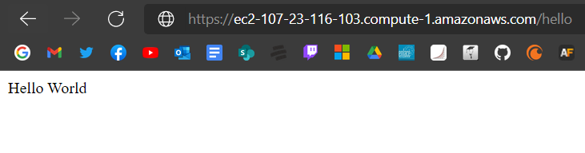
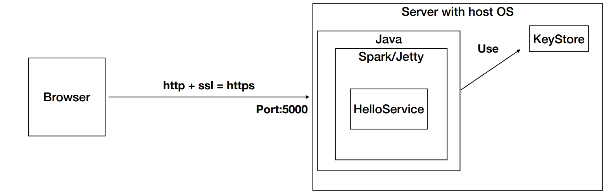

# Spark Secure

Una aplicación Web segura con los siguientes requerimientos:

- Debe permitir un acceso seguro desde el browser a la aplicación. Es decir debe garantizar autenticación, autorización e integridad de usuarios.
- Debe tener al menos dos computadores comunicacndose entre ellos y el acceso de servicios remotos debe garantizar: autenticación, autorización e integridad entre los servicios. Nadie puede invocar los servicios si no está autorizado.


### Prerequisites

* Maven - Dependency Management
* Java 8 -  Development Environment 
* Git - Version Control System

### Installing

1. Clonar el repositorio

```
git clone https://github.com/Javier200151/AREP-APLICACI-N-DISTRIBUIDA-SEGURA-EN-TODOS-SUS-FRENTES
```

2. Compilar y generar dependencias

```
mvn clean install
```

3. Correr proyecto con

```
java -cp "target/classes:target/dependency/*" edu.escuelaing.arep.HelloService
```

4. AWS



## Arquitectura



El browser con https que crea un canal cifrado apropiado para el trafico de información sensible para el protocolo HTTP
El servidor que lleva la aplicación java, tambien lleva la llaves de cifrado y de certificado que se crearon para este taller
mediante el uso de un micro servicio, en este caso Spark, llamamos al servicio Hello que nos retorna un "HelloWorld!"
este va a comprobar el certificado de llaves (el cual el browser seguramente no confiará) y hará la conexión por el protocolo HTTPS

## Built With

* Maven - Dependency Management
* Spark - Micro framework para la creación de aplicaciones java 8

## Author

* **Javier Esteban López Peña** 
